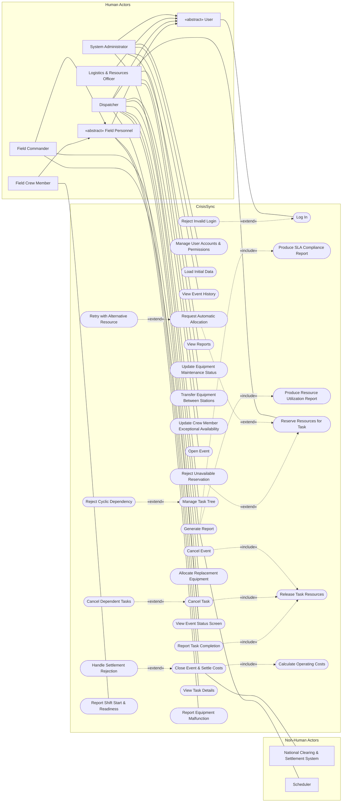

# CrisisSync - Use Case Diagram (Mermaid mirror)

Mirror of `useCase.puml` (the PlantUML source of truth). The final model is built in Visual Paradigm 18.1.

```mermaid
%% Mermaid mirror of useCase.puml (PlantUML is the source of truth).
%% Mermaid has no use-case diagram type: actors = boxes, use cases = stadiums,
%% generalization = solid arrow child --> parent, include/extend = dashed labeled arrows.
%% Extension points and extend conditions are listed in useCase.puml.
flowchart LR

  subgraph HumanActors["Human Actors"]
    direction TB
    USER["«abstract» User"]
    SA["System Administrator"]
    LO["Logistics & Resources Officer"]
    D["Dispatcher"]
    FP["«abstract» Field Personnel"]
    FC["Field Commander"]
    FCM["Field Crew Member"]
  end

  subgraph CrisisSync["CrisisSync"]
    direction TB
    Login(["Log In"])
    RejectLogin(["Reject Invalid Login"])

    ManageUsers(["Manage User Accounts & Permissions"])
    LoadData(["Load Initial Data"])
    EventHistory(["View Event History"])
    GenerateReport(["Generate Report"])
    SLAReport(["Produce SLA Compliance Report"])
    UtilizationReport(["Produce Resource Utilization Report"])
    ViewReports(["View Reports"])

    Maintenance(["Update Equipment Maintenance Status"])
    TransferEquipment(["Transfer Equipment Between Stations"])
    ExceptionalAvailability(["Update Crew Member Exceptional Availability"])

    OpenEvent(["Open Event"])
    CancelEvent(["Cancel Event"])
    ManageTaskTree(["Manage Task Tree"])
    RejectCycle(["Reject Cyclic Dependency"])
    ReserveResources(["Reserve Resources for Task"])
    AutoAllocation(["Request Automatic Allocation"])
    RetryAlternative(["Retry with Alternative Resource"])
    RejectReservation(["Reject Unavailable Reservation"])
    ReplaceEquipment(["Allocate Replacement Equipment"])
    CancelTask(["Cancel Task"])
    CancelDependents(["Cancel Dependent Tasks"])
    ReleaseResources(["Release Task Resources"])
    EventStatus(["View Event Status Screen"])
    CloseEvent(["Close Event & Settle Costs"])
    CalculateCosts(["Calculate Operating Costs"])
    SettlementRejection(["Handle Settlement Rejection"])

    TaskCompletion(["Report Task Completion"])
    TaskDetails(["View Task Details"])
    EquipmentMalfunction(["Report Equipment Malfunction"])
    ShiftReadiness(["Report Shift Start & Readiness"])
  end

  subgraph NonHumanActors["Non-Human Actors"]
    direction TB
    NCSS["National Clearing & Settlement System"]
    SCHED["Scheduler"]
  end

  %% Generalization (child --> parent)
  SA --> USER
  LO --> USER
  D --> USER
  FP --> USER
  FC --> FP
  FCM --> FP

  %% Associations (plain lines, no arrows)
  USER --- Login

  SA --- ManageUsers
  SA --- LoadData
  SA --- EventHistory
  SA --- GenerateReport
  SA --- ViewReports

  LO --- Maintenance
  LO --- TransferEquipment
  LO --- ExceptionalAvailability

  D --- OpenEvent
  D --- CancelEvent
  D --- ManageTaskTree
  D --- ReserveResources
  D --- ReplaceEquipment
  D --- CancelTask
  D --- EventStatus
  D --- CloseEvent

  FC --- EventStatus
  FC --- TaskCompletion
  FP --- TaskDetails
  FP --- EquipmentMalfunction
  FCM --- ShiftReadiness

  CloseEvent --- NCSS
  GenerateReport --- SCHED

  %% include: base -.-> included
  CancelEvent -. "«include»" .-> ReleaseResources
  CancelTask -. "«include»" .-> ReleaseResources
  TaskCompletion -. "«include»" .-> ReleaseResources
  GenerateReport -. "«include»" .-> SLAReport
  GenerateReport -. "«include»" .-> UtilizationReport
  CloseEvent -. "«include»" .-> CalculateCosts

  %% extend: extension -.-> base
  RejectLogin -. "«extend»" .-> Login
  RejectCycle -. "«extend»" .-> ManageTaskTree
  AutoAllocation -. "«extend»" .-> ReserveResources
  RetryAlternative -. "«extend»" .-> AutoAllocation
  RejectReservation -. "«extend»" .-> ReserveResources
  CancelDependents -. "«extend»" .-> CancelTask
  SettlementRejection -. "«extend»" .-> CloseEvent
```
